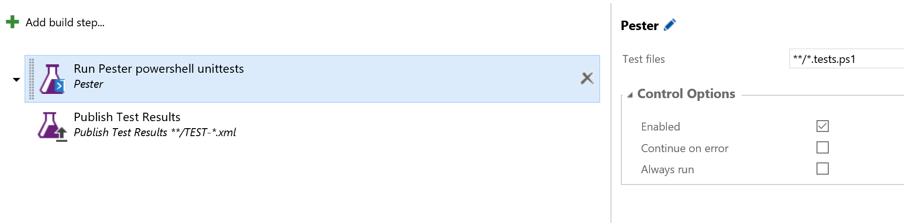
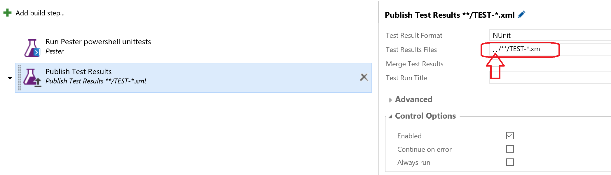

# Run Pester in VSTS build and release tasks
This build and release extension enables your to run Powershell unit test in your build and release pipelines. It uses the Pester Powershell test framework.

## Pester
[Pester](https://github.com/pester/Pester) will enable you to test your Powershell scripts from within Powershell. It is a set of function for unit testing Powershell functions. These functions will allow you to mock and issolate your test cases.

## Pester build and release extension
This extension will run your pester unit test in a build and release pipeline. 
The task will first check if Pester is installed. If Pester is installed, it uses the installed Pester version. When Pester is not installed, the task will install the latest stable Pester version.
On failure you can choose to break the build or just show it in the test results.

### Run tests
For running the tests you can configure the task like:

```
Test files: **/*.tests.ps1
Fail build on error: true
```



This will run all *.tests.ps1 files in your repository

### Upload test results VSTS
When you want the test results visible in VSTS, you need to upload the test result file. This can be done with the Upload test results task. Pester will write the test results in nUnit format to a test results file. This test results file is located in the test results directory.

The following configuration can be used:

```
Test Result Format: nUnit
Test Results Files: ../**/TEST-*.xml
Always run: true
```


